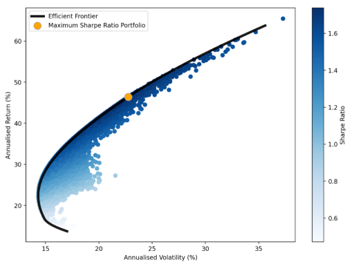

# Portfolio Optimization Dashboard

The **Stock Portfolio Optimization** application utilizes a variety of advanced optimization techniques and supportive tools to enhance portfolio performance. With interactive visualizations of the efficient frontier and key portfolio metrics, it delivers an intuitive and user-friendly experience through its web-hosted Streamlit interface.

## Optimization Strategies

**Sharpe Ratio**  
Evaluates the return generated for each unit of total risk taken. A higher Sharpe Ratio indicates more effective risk-adjusted return generation, helping investors maximize returns relative to risk.

**Volatility**  
Measures the standard deviation of portfolio returns, providing insight into the portfolio's risk level. Lower volatility signifies a more stable investment, aligning with conservative investment strategies.

**Sortino Ratio**  
Focuses on downside risk by assessing returns per unit of negative volatility. Ideal for investors prioritizing capital preservation and minimizing significant losses. A higher Sortino Ratio reflects better performance during adverse conditions.

**Tracking Error**  
Assesses how closely a portfolio's returns follow its benchmark. Lower Tracking Error signifies greater consistency with benchmark performance, suitable for investors aiming to mirror index performance.

**Information Ratio**  
Measures excess returns over a benchmark relative to the active risk taken. A higher Information Ratio indicates successful active management and effective outperformance of the benchmark.

**Conditional Value-at-Risk (CVaR)**  
Estimates potential losses in extreme market conditions by focusing on worst-case scenarios. Lower CVaR values indicate better risk mitigation, essential for risk-averse investors.

**Hierarchical Risk Parity (HRP)**  
An advanced optimization technique that builds a diversified portfolio by hierarchically clustering assets based on their correlations. It allocates weights to balance risk across clusters, reducing reliance on traditional covariance matrices. Ideal for investors seeking diversification and stability without the assumptions of mean-variance optimization.

**Hierarchical Equal Risk Contribution (HERC)**  
Enhances the HRP method by ensuring that each cluster contributes equally to the overall portfolio risk. Combining hierarchical clustering with equal risk contribution principles, it offers a balanced approach to diversification. Suitable for investors aiming for an equal distribution of risk among asset clusters.

**Distributionally Robust CVaR**  
A conservative risk management approach that accounts for uncertainty in the distribution of asset returns when calculating CVaR. It provides more robust risk estimates under distributional ambiguity, ideal for investors looking to protect against model misspecification and extreme market movements.

**Black-Litterman Model with Empirical Prior**  
Blends market equilibrium returns with an investor's unique views to generate a new set of expected returns. Using historical market data as the prior mitigates estimation errors and reduces portfolio sensitivity to input assumptions. Ideal for investors who wish to incorporate their perspectives into the optimization process while maintaining a balance with market consensus, resulting in more stable and diversified portfolios.

**Minimize EVaR (Entropic Value at Risk)**  
Focuses on reducing potential extreme losses by considering worst-case scenarios more conservatively than traditional risk measures. EVaR provides tighter estimates of potential losses during extreme market conditions, making it ideal for highly risk-averse investors seeking to safeguard their portfolios against rare but severe downturns.

**Risk Budgeting with EDAR (Entropic Drawdown at Risk)**  
Allocates risk among assets by minimizing the sum of individual entropic drawdowns, focusing on managing potential severe declines in asset values. EDAR measures the worst-case drawdown in a conservative manner, capturing extreme negative movements. This strategy ensures that each asset's risk is budgeted according to predefined levels, promoting a diversified and risk-aware portfolio.

## Other Tools

### **Market Scenario Generation**

Generate market scenarios for the S&P 500 index using *flow models* [1] and Time-GAN [2]. This feature allows investors to simulate various market conditions, aiding in robust portfolio planning and stress testing.

### **Stock Price Forecasting**

Forecast stock prices using *Neural Ordinary Differential Equations* (Neural ODE) integrated with forecast intervals constructed by *Adaptive Conformal Inference*. Currently supports *univariate forecasting*, providing investors with predictive insights and uncertainty estimates to inform decision-making.

## Assumptions

The portfolio allocation models depend on on various assumptions, which oftens restrict theirs usefulness in practical applications:
- **Historical Returns as Predictors**: The model assumes that past returns indicate future performance, using historical data to estimate expected returns based on observed patterns.
- **No Transaction Costs**: The model assumes there are no transaction costs or taxes related to buying, selling, or rebalancing assets, which may lead to less realistic outcomes.
- **Full Investment**: It assumes that all available capital is fully invested, with no cash reserves, eliminating considerations of cash drag or liquidity.
- **Fixed Time Horizon**: The model operates on a fixed investment period, assuming that the investor’s objectives and risk tolerance remain constant, regardless of market changes.

## Features

**Interactive Visualisations**: Graphs and charts that visualize the efficient frontier, allowing the user to assess various portfolio scenarios and understand key metrics intuitively.

**Risk Management**: Dedicated tools to evaluate and manage risk, helping the user make informed decisions based on their risk tolerance and investment strategy.

**Statistical Metrics**: A comprehensive suite of statistical measures, including skewness and kurtosis to gain deeper insights into portfolio performance and returns.

**Benchmark Comparison**: Visualisation of portfolio returns against the benchmark index, providing the user a clear understanding of their investment's relative performance and effectiveness.

## Efficient frontier
The Efficient Frontier is visualized as a curve representing the optimal set of investment portfolios that offer the highest expected return for a given level of risk, created using 10,000 simulations of portfolios with varying asset weights. Each point along the frontier illustrates the trade-off between risk (volatility) and return, enabling users to identify the most efficient portfolios. Portfolios lying on this curve are considered optimal, while those below the frontier indicate suboptimal returns for their associated risk levels, allowing investors to make informed decisions based on their individual risk tolerance and investment goals.



## Getting Started

### Prerequisites

- Python 3.8 or higher
- Required Python libraries (listed in `requirements.txt`)

### Installation

Follow these steps to clone the repository and set up the required environment.

## 1. **Clone the Repository**

First, clone the repository to your local machine and navigate into the project directory.

```console
git clone https://github.com/CallmeQuant/stock-portfolio-optimization.git
cd stock-portfolio-optimization
```

## 2. **Environment Setup**

To install the necessary package dependencies, set up a Python virtual environment (e.g., using Conda or `venv`) and install the required packages.

### Create and activate a virtual environment (optional)

If you’re using Conda:

```console
conda create -n portfolio-optimization python=3.8
conda activate portfolio-optimization
```

Or using `venv`:

```console
python -m venv venv
source venv/bin/activate  # On Windows use: venv\Scripts\activate
```

### Install dependencies

Install the specific package and other required packages listed in `requirements.txt`.

```console
pip install -r requirements.txt
```

### Running the Application

Start the Streamlit application with the following command:

```console
streamlit run app.py
```

Open your web browser and navigate to the URL provided in the terminal to access the dashboard.

<!-- ## Usage
See full instructions in the [docs](./install.md)
<!-- 
1. 
2. Enter your tickers, start and end dates, and risk-free rate in the input fields.
3. Select an optimization strategy from the dropdown menu.
4. Click the "Calculate" button to generate your optimized portfolio.
5. Explore the various tabs to view performance metrics, visualizations, and risk analysis for your portfolio. --> 

## Contributing

Contributions are welcome! Please fork the repository and submit a pull request with your enhancements.

## Reference

The generative models bases on work and official code of the following articles (with modifications):
[1] Alaa, A., Chan, A. J., & van der Schaar, M. 2021. Generative time-series modeling with Fourier flows. In Proceedings of the International Conference on Learning Representations.
[2] Yoon, J., Jarrett, D. and Van der Schaar, M., 2019. Time-series generative adversarial networks. Advances in neural information processing systems, 32. 
[3] Lou, H., Tao, J., Dong, X., Xiao, B., Jiang, L., & Ni, H. (2023). Evaluation of time series generative models. GitHub. Retrieved from https://github.com/DeepIntoStreams/Evaluation-of-Time-Series-Generative-Models.git

## License

This project is licensed under the [MIT](LICENSE).

## Contact

For any inquiries or support, please contact [binhho660@gmail.com](mailto:binhho660@gmail.com).
